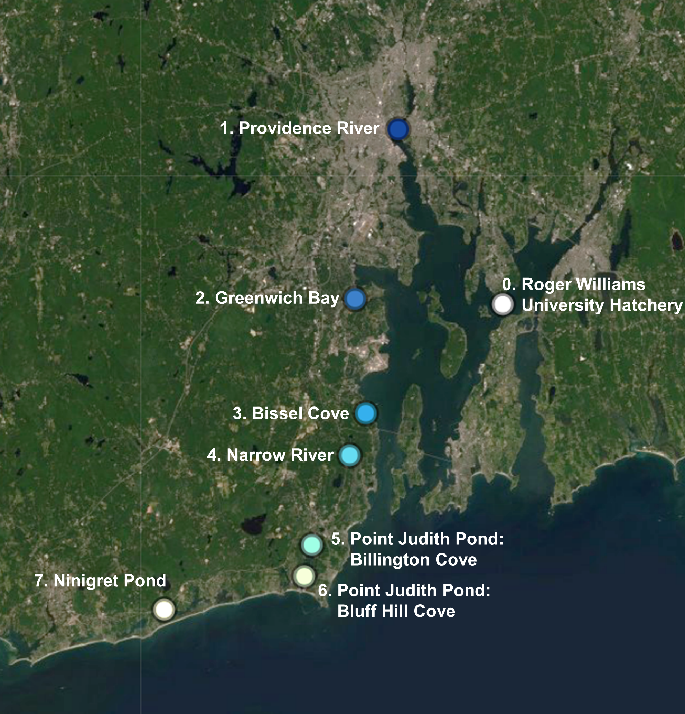

# Combined processed data files and Rscripts for oysters collected from all sites in Narragansett Bay.
## Code written by Rebecca Stevick, URI-GSO (contact: rjstevick (at) gmail.com)

### This repository contains the pre-processed sequencing data and the Rscripts to reproduce the figures in the final chapter of my dissertation. All data used has been previously published/analyzed in other chapters. This repo is mainly to save the R analysis and figure commands. 

### To cite this work: 
Stevick, R. J. (2019). Oyster-Associated Microbial Community Dynamics (Doctoral dissertation, University of Rhode Island). https://digitalcommons.uri.edu/oa_diss/1089/

Map of dissertation study area with experimental sites highlighted:

----------------------------------------------------------------------------------------

# Contents
